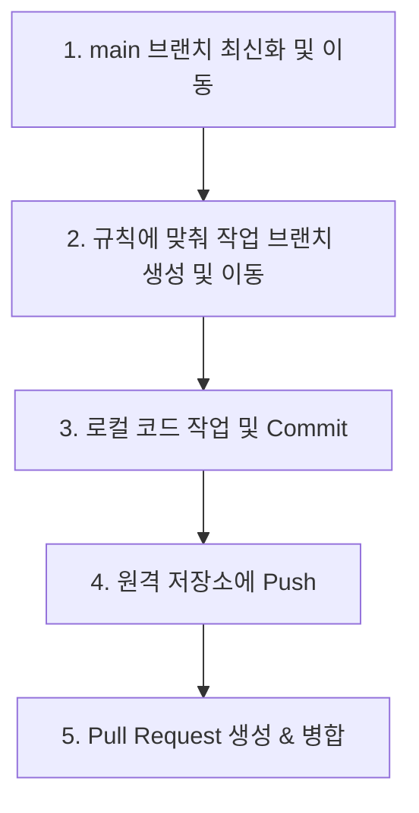

# 🏥 Medibridge HIS

Medibridge 병원 정보 시스템(HIS) 리포지토리입니다.  
프로젝트의 원활한 협업과 체계적인 버전 관리를 위해 아래의 **Git 브랜치 명명 규칙** 및 **작업 워크플로우**를 반드시 준수해 주시기 바랍니다.

---

## 📂 디렉토리 구조 및 매칭 객체 (Directory Structure & Actors)

본 프로젝트의 패키지 및 페이지 디렉토리 구조는 병원 내 직무 역할(Actor)을 기준으로 분할되어 있습니다.

| 디렉토리/패키지명 | 매칭 객체 (역할군 / 기능) |
| :--- | :--- |
| `login` | 로그인 |
| `receptionist` | 원무 행정 |
| `outpatientNurse` | 외래 간호사 |
| `doctor` | 의사 |
| `physicalTherapist` | 물리치료사 |
| `pharmacist` | 약사 |
| `admin` | 관리자 |

---

## 📌 Git 브랜치 명명 규칙 (Branch Naming Convention)

브랜치를 생성할 때 구성원 간 서로 작업 영역을 한눈에 식별할 수 있도록 아래 규칙을 따라 명명합니다.

### 1. 브랜치 명명 구조
> `접두어/기능명/작업자약자MMDD`

* **구분자**: 모든 요소는 **슬래시(`/`)**로 구분합니다.
* **기능명**: 영문 소문자 사용을 권장하며, 명확하고 간결한 단어로 작성합니다.
* **작업자약자MMDD**: 본인 이름의 이니셜 대문자 **3자리**와 작업 시작일(**월/일**)을 붙여서 작성합니다.

---

### 2. 접두어 (Prefix) 종류
협업의 명확성을 위해 목적에 적합한 접두어를 사용해야 합니다.

| 접두어 | 설명 |
| :---: | :--- |
| <span style="color:#2ecc71">**feat**</span> | 새로운 기능 개발 |
| <span style="color:#e74c3c">**hotfix**</span> | 운영 또는 개발 환경의 긴급 오류 수정 |
| <span style="color:#3498db">**refact**</span> | 기능 변경이 없는 코드 구조 개선 (리팩토링) |

---

### 💡 작성 예시
작업 시작일이 `6월 23일`이고 이니셜이 `KJA`인 작업자의 경우:

* **새로운 접수 기능 개발 시**
  ```bash
  feat/reception/KJA0623
  ```
* **접수 기능의 긴급 버그 수정 시**
  ```bash
  hotfix/reception/KJA0623
  ```
* **접수 기능의 코드를 리팩토링할 시**
  ```bash
  refact/reception/KJA0623
  ```

---

## 🚀 Git 작업 워크플로우 (Git Workflow)

안전하고 충돌 없는 메인 브랜치 관리를 위해 코드를 작업하고 배포할 때는 아래 흐름을 따라 작업해 주세요.

### 📋 단계별 가이드



#### **1단계: main 브랜치 최신화 및 이동**
작업을 시작하기 전, 항상 로컬의 `main` 브랜치를 원격 저장소의 최신 상태로 동기화합니다.
```bash
# main 브랜치로 이동
git checkout main

# 원격 저장소의 최신 코드 다운로드
git pull origin main
```

#### **2단계: 작업 브랜치 생성 및 이동**
브랜치 명명 규칙에 부합하는 새로운 브랜치를 생성하고 이동합니다.
```bash
# 브랜치 생성과 동시에 이동 (-b 옵션)
git checkout -b 접두어/기능명/작업자약자MMDD

# (예시)
git checkout -b feat/reception/KJA0623
```

#### **3단계: 코드 작업 및 로컬 커밋**
코드를 개발하거나 수정한 후, 변경사항을 커밋합니다.
```bash
# 변경된 파일 스테이징
git add .

# 의미 있는 커밋 메시지와 함께 커밋
git commit -m "feat: 접수 관련 기능 구현"
```

#### **4단계: 원격 저장소로 푸시 (Push)**
작성한 로컬 브랜치를 원격 저장소(GitHub/GitLab)로 업로드합니다.
```bash
# 원격 저장소에 내 브랜치 푸시
git push origin 접두어/기능명/작업자약자MMDD

# (예시)
git push origin feat/reception/KJA0623
```

#### **5단계: Pull Request (PR) 생성 및 사전 검증 후 병합**
원격 저장소 웹 페이지에 접속하여 `main` 브랜치 방향으로 **Pull Request(PR)**를 생성합니다.  
별도의 승인 대기 없이 즉시 `main` 브랜치에 병합(Merge)이 가능하지만, **병합 전 반드시 로컬에서 아래 검증 과정을 수행하여 기능 오류 및 코드 충돌(Conflict)이 없는지 확인**해야 합니다.

##### **① 충돌 사전 검증 (로컬에서 main 합쳐보기)**
내 작업 브랜치에 `main` 브랜치의 최신 코드를 임시로 병합하여 충돌이 발생하는지 확인하고 해결합니다.
```bash
# 로컬의 main 브랜치로 이동 및 최신화
git checkout main
git pull origin main

# 다시 작업 브랜치로 이동
git checkout feat/reception/KJA0623

# main의 최신 코드를 내 작업 브랜치에 병합 (충돌 확인)
git merge main
# (만약 충돌이 발생하면 충돌한 코드를 로컬 에디터에서 정리한 뒤 git add 및 git commit을 해줍니다.)
```

##### **② 로컬 기동 및 기능 검증**
충돌이 없거나 해결되었다면, 로컬 개발 환경에서 애플리케이션을 직접 구동(로컬 서버 기동 또는 데브 서버 실행 등)하여 실행 에러가 없는지 확인합니다.
* 새로 작업한 화면 또는 API가 에러 콘솔이나 오작동 없이 의도한 대로 완벽히 동작하는지 직접 확인 및 자가 테스트를 진행합니다.

##### **③ 최종 병합 진행**
로컬에서 기능 동작 및 충돌에 문제가 없음을 확인했다면, 원격 저장소 웹 페이지의 PR 페이지에서 **Merge**를 최종 완료합니다.
